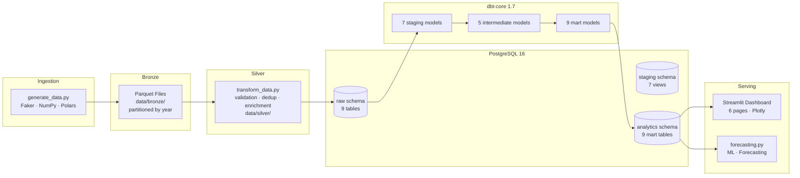
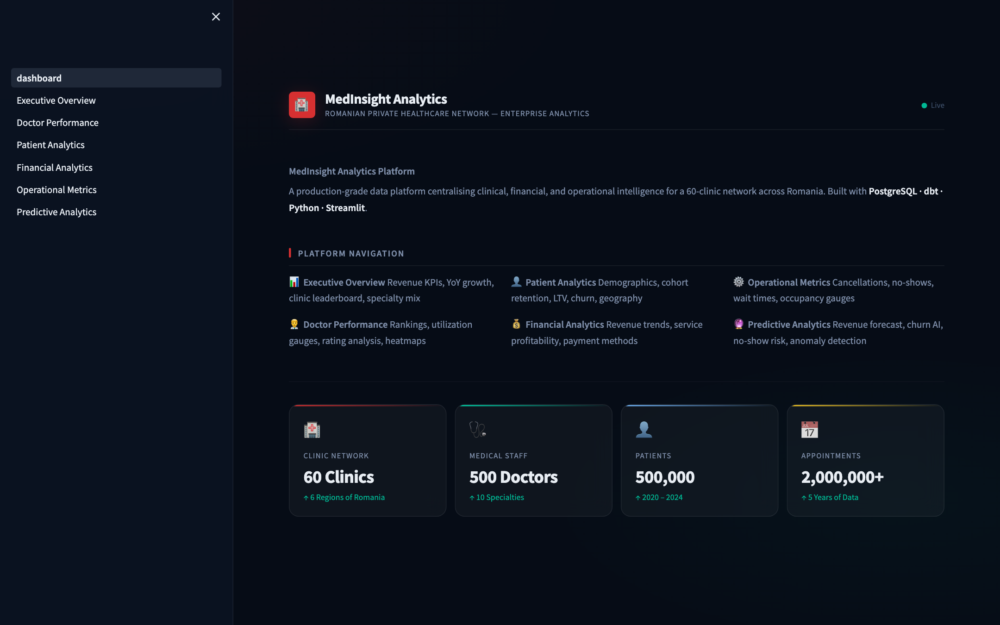
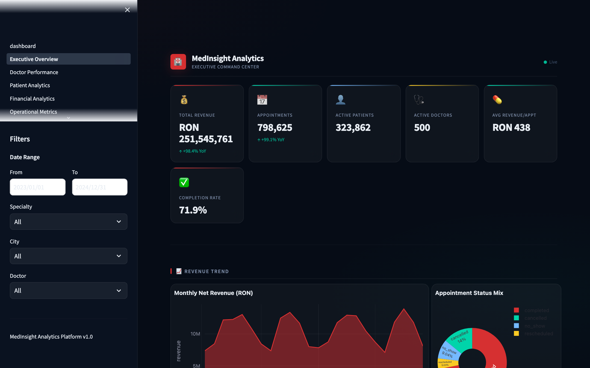
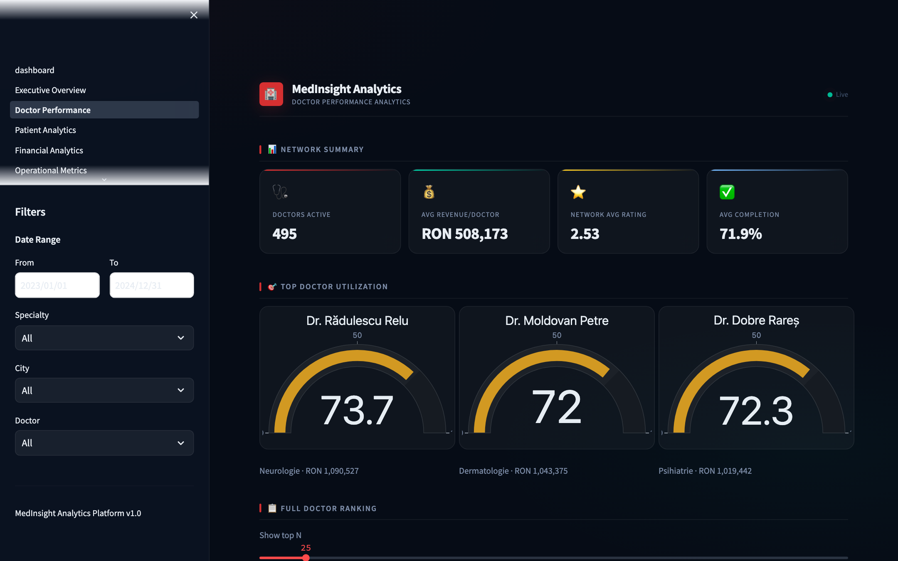
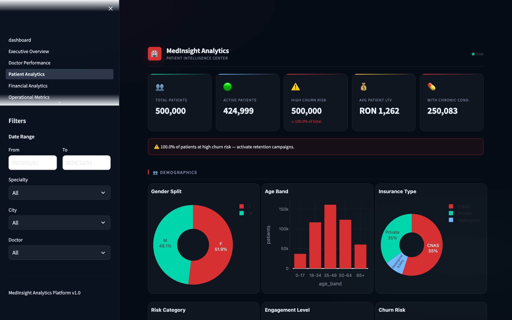
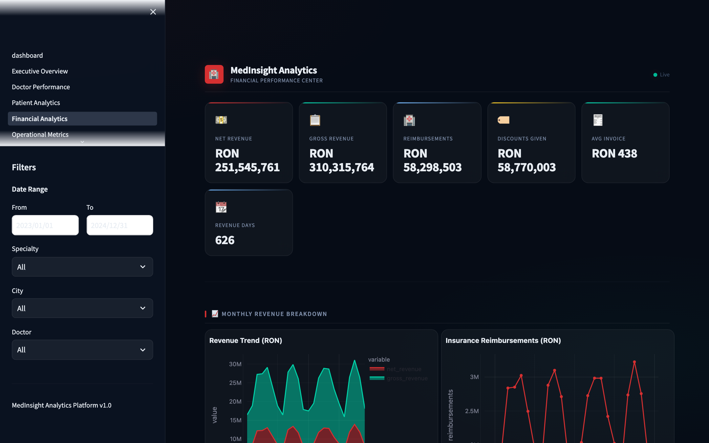
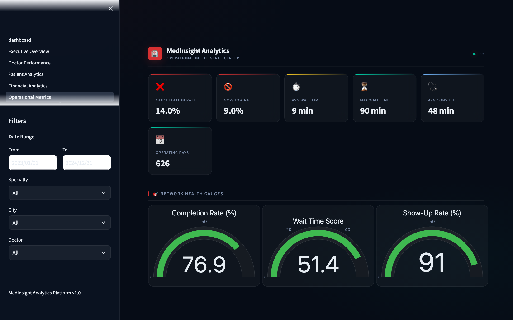
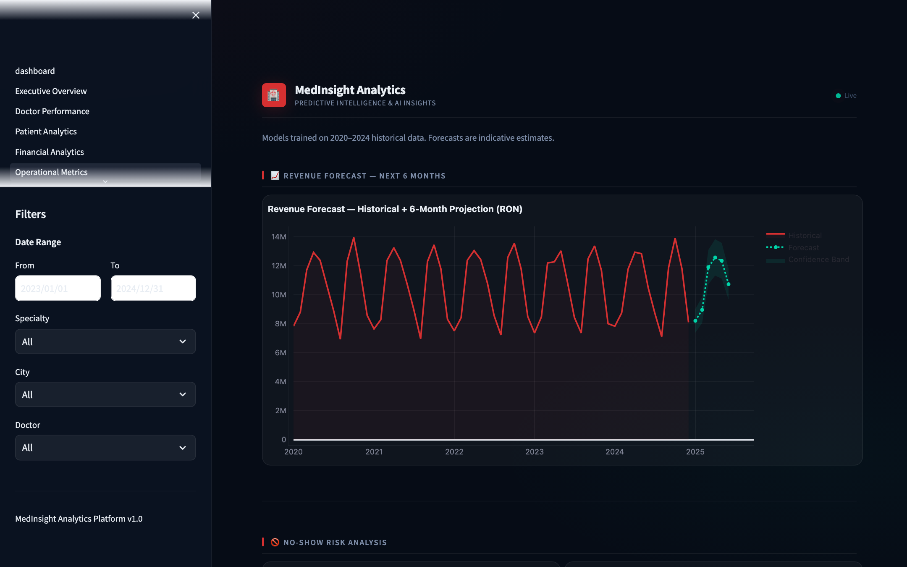

# MedInsight Analytics Platform

> Enterprise healthcare data engineering portfolio project — end-to-end analytics platform
> modelled after a Romanian private clinic network.


---

## Business Problem

A Romanian private healthcare network operating **60 clinics** across 6 regions needs to
centralise its operational, clinical, and financial data. Clinic managers make decisions
from disconnected spreadsheets; the executive team lacks YoY visibility; no-show rates
exceed 9% with no systematic tracking; and patient retention is unmeasured.

**MedInsight Analytics Platform** solves this by ingesting raw transactional data,
transforming it through a medallion architecture, and surfacing it in an executive-grade
Streamlit dashboard — giving every stakeholder a single source of truth.

---

## Solution Overview

| Layer | Technology | What it does |
|-------|-----------|--------------|
| Ingestion | Python + NumPy | Generates / ingests 2M appointment records |
| Bronze | Parquet (partitioned) | Immutable raw snapshots |
| Silver | Pandas + PyArrow | Cleaned, validated, enriched datasets |
| Warehouse | PostgreSQL 16 | Structured relational store with indexes |
| Transformation | dbt-core 1.7 | 22 SQL models: staging → intermediate → marts |
| Analytics | scikit-learn + statsmodels | Revenue forecast, churn, anomaly detection |
| Dashboard | Streamlit + Plotly | 6-page executive BI dashboard |

---

## Architecture



### Medallion Architecture

```
┌─────────────────────────────────────────────────────────────────┐
│  BRONZE  │  Raw Parquet snapshots — immutable, append-only       │
│  ────────┼───────────────────────────────────────────────────── │
│  SILVER  │  Cleaned · validated · type-enforced · deduplicated   │
│  ────────┼───────────────────────────────────────────────────── │
│  GOLD    │  dbt-built fact/dimension tables — analytics-ready    │
└─────────────────────────────────────────────────────────────────┘
```

---

## Data Scale

| Entity | Volume | Period |
|--------|--------|--------|
| Clinics | 60 (across 6 Romanian regions) | — |
| Doctors | 500 (10 specialties) | — |
| Patients | 500,000 | — |
| Appointments | 2,000,000 | 2020–2024 |
| Billing records | ~1.4M | 2020–2024 |
| Prescriptions | ~737k | 2020–2024 |
| Lab results | ~904k | 2020–2024 |

---

## Tech Stack

```
Data Generation   Faker (ro_RO) · NumPy · Pandas · Polars · PyArrow
Database          PostgreSQL 16 (raw / staging / intermediate / analytics schemas)
Transformation    dbt-core 1.7 · dbt-postgres · Jinja2 macros
Analytics / ML    scikit-learn · statsmodels · DuckDB
Dashboard         Streamlit 1.33 · Plotly 5.21
Engineering       SQLAlchemy 2 · psycopg2 (COPY bulk-load) · loguru · rich · typer
Config            pydantic-settings · python-dotenv · PyYAML
Testing           pytest · pytest-cov · pytest-mock
Dev tooling       Docker Compose · Makefile
```

---

## Project Structure

```
medical_data_platform/
│
├── data/                       # Generated datasets (gitignored)
│   ├── raw/                    # CSV snapshots
│   ├── bronze/                 # Partitioned Parquet (immutable)
│   ├── silver/                 # Cleaned Parquet
│   ├── gold/                   # (reserved for local Parquet exports)
│   └── exports/                # ML outputs, quality reports
│
├── scripts/
│   ├── generate_data.py        # Vectorised data generator (2M appointments)
│   ├── load_postgres.py        # COPY-based bulk loader + schema DDL
│   ├── transform_data.py       # Bronze → Silver transformation
│   ├── quality_checks.py       # 39-check custom quality framework
│   ├── run_pipeline.py         # End-to-end orchestrator
│   ├── forecasting.py          # Revenue forecast, churn, anomaly detection
│   └── seed_reference_tables.py
│
├── dbt/
│   ├── models/staging/         # stg_* — type casting, source cleanup
│   ├── models/intermediate/    # int_* — business logic, joins
│   ├── models/marts/           # fct_* + dim_* — analytics-ready tables
│   ├── macros/                 # generate_schema_name, safe_divide, date_spine
│   ├── dbt_project.yml
│   └── profiles.yml.example
│
├── dashboard/
│   ├── dashboard.py            # Streamlit entry point
│   ├── pages/                  # 6 dashboard pages
│   ├── components/             # db.py · charts.py · filters.py · kpi_cards.py
│   └── assets/style.css        # Premium dark medical theme
│
├── sql/
│   ├── ddl/init.sql            # Schema creation
│   ├── analytics/              # Showcase SQL (RFM, YoY revenue, rankings)
│   └── optimization/indexes.sql
│
├── tests/
│   ├── unit/                   # generate_data, settings
│   ├── integration/
│   └── data_quality/           # Quality framework tests
│
├── docs/                       # Architecture, data dictionary, guides
├── screenshots/                # Dashboard screenshots
├── config/                     # settings.py (pydantic), config.yaml
├── docker-compose.yml          # PostgreSQL + pgAdmin
├── Makefile                    # One-command workflow
├── requirements.txt
├── setup.sh
└── .env.example
```

---

## dbt Models

### Staging (7 models — views)

| Model | Source | Description |
|-------|--------|-------------|
| `stg_appointments` | raw.appointments | Type casting, status flags, time dimensions |
| `stg_patients` | raw.patients | Age bands, risk categories, CNP cleaning |
| `stg_doctors` | raw.doctors | Seniority bands, tenure calculation |
| `stg_payments` | raw.billing | Net revenue, invoice periods |
| `stg_services` | raw.services | Price and margin normalisation |
| `stg_prescriptions` | raw.prescriptions | Duration capping |
| `stg_lab_results` | raw.lab_results | Turnaround hours, abnormality flags |

### Intermediate (5 models — views)

| Model | Description |
|-------|-------------|
| `int_appointment_metrics` | Enriched appointments joined to doctors, clinics, services |
| `int_doctor_metrics` | Per-doctor KPI aggregation + performance tier |
| `int_patient_metrics` | Per-patient visit history, LTV, churn classification |
| `int_revenue_metrics` | Revenue joined to geography and specialty |
| `int_operational_metrics` | Daily ops: completion/cancel/no-show rates |

### Marts (9 models — tables)

| Model | Grain | Key Metrics |
|-------|-------|-------------|
| `fct_appointments` | 1 row / appointment | Full enriched fact table |
| `fct_daily_revenue` | Day × City × Specialty | Gross/net revenue, reimbursements |
| `fct_doctor_performance` | 1 row / doctor | Revenue rank, utilisation, completion rate |
| `fct_patient_retention` | Cohort × Period | Monthly retention rates |
| `fct_operational_efficiency` | Month × Clinic × Specialty | Cancellation/no-show rates |
| `dim_doctors` | 1 row / doctor | SCD1 doctor dimension |
| `dim_patients` | 1 row / patient | LTV, engagement, churn risk |
| `dim_services` | 1 row / service | Margin, reimbursement rates |
| `dim_clinics` | 1 row / clinic | City, region, aggregated stats |

---

## Dashboard Pages

| Page | Key Widgets |
|------|-------------|
| 📊 **Executive Overview** | Revenue KPIs, YoY growth, clinic leaderboard, specialty mix |
| 👨‍⚕️ **Doctor Performance** | Utilisation gauges, revenue ranking, rating scatter, heatmap |
| 👤 **Patient Analytics** | Demographics, cohort retention, LTV, churn risk, geography |
| 💰 **Financial Analytics** | Revenue trends, service profitability, payment methods |
| ⚙️ **Operational Metrics** | Network health gauges, cancellation drivers, wait-time heatmap |
| 🔮 **Predictive Analytics** | 6-month revenue forecast, no-show risk, churn AI, anomaly detection |

---

## Screenshots

### Home



### Executive Overview
*RON 251M net revenue · 798k appointments · 323k active patients · 71.9% completion rate*



### Doctor Performance
*495 doctors ranked by revenue, utilisation gauges, rating scatter, appointment heatmap*



### Patient Analytics
*500k patient demographics, cohort retention matrix, LTV analysis, churn risk*



### Financial Analytics
*RON 310M gross revenue, monthly trend, service profitability, payment methods*



### Operational Metrics
*Network health gauges, cancellation drivers, wait-time heatmap by day × hour*



### Predictive Analytics
*6-month revenue forecast, no-show risk factors, churn segments, anomaly detection*



---

## Quick Start

### Prerequisites

- Python 3.11+
- PostgreSQL 16 (local or Docker)
- ~2 GB free disk space for generated data

### 1. Clone & setup

```bash
git clone https://github.com/MartiniucV/data-engineering-portfolio.git
cd data-engineering-portfolio/medical_data_platform

python3 -m venv .venv && source .venv/bin/activate
pip install -r requirements.txt

cp .env.example .env          # edit DB credentials if needed
```

### 2. Start PostgreSQL (Docker)

```bash
docker-compose up -d postgres
# wait ~10s for health check to pass
```

### 3. Generate data

```bash
python scripts/generate_data.py
# ~100s — generates 2M appointments, 500k patients, 1.4M billing records
```

### 4. Load PostgreSQL

```bash
python scripts/load_postgres.py
# ~3 min — uses PostgreSQL COPY for bulk loading
```

### 5. Run dbt

```bash
cd dbt
dbt deps                        # install dbt-utils package
dbt run --profiles-dir .        # build all 22 models (~26s)
dbt test --profiles-dir .       # run 29 data tests
cd ..
```

### 6. Launch dashboard

```bash
streamlit run dashboard/dashboard.py
# opens at http://localhost:8501
```

### Or run everything at once

```bash
python scripts/run_pipeline.py          # skips dbt by default
# or
make all                                # full pipeline via Makefile
```

---

## Makefile Commands

```
make setup        Create virtualenv + install dependencies
make generate     Generate synthetic datasets
make load         Load data into PostgreSQL
make dbt-run      Run all dbt models
make dbt-test     Run dbt tests
make quality      Run 39-check quality framework
make forecast     Run ML and forecasting models
make test         Run pytest suite
make dashboard    Launch Streamlit dashboard
make all          Full pipeline end-to-end
```

---

## Key Business KPIs

| KPI | Definition | Threshold |
|-----|-----------|-----------|
| **Completion Rate** | Completed / Total appointments | Target ≥ 70% |
| **No-Show Rate** | No-shows / Total appointments | Alert > 10% |
| **Cancellation Rate** | Cancelled / Total appointments | Alert > 15% |
| **Patient LTV** | Σ net revenue per patient | Segment by quartile |
| **Avg Wait Time** | Mean waiting_time_minutes | Target < 20 min |
| **Revenue/Active Day** | Total revenue / Active days | Track per doctor |
| **Churn Risk** | Days since last visit > 180 | Trigger re-engagement |
| **Cohort Retention M1** | Patients with visit in month 1 | Benchmark > 40% |

---

## Advanced Analytics

| Module | Technique | Output |
|--------|-----------|--------|
| Revenue Forecasting | Holt-Winters ETS | 6-month projection with confidence band |
| No-Show Risk | Gradient Boosted Trees | Feature importance, AUC score |
| Patient Churn | RFM segmentation | Champions / Loyal / At Risk / Lost |
| Cohort Retention | Pivot cohort matrix | Monthly retention heatmap |
| Anomaly Detection | Isolation Forest | Billing anomaly flags |
| Doctor Utilisation | Aggregation + window functions | Utilisation rate leaderboard |

---

## Data Quality Framework

`scripts/quality_checks.py` runs 39 checks across 7 dimensions:

- **Null checks** — max 2% null rate on critical columns
- **Uniqueness** — zero duplicates on primary keys
- **Referential integrity** — < 1% orphan records
- **Range validation** — ages 0–120, ratings 1–5, prices ≥ 0
- **Accepted values** — status, gender, payment_status enums
- **Statistical anomalies** — Z-score > 3.5 flagged
- **Freshness** — validates data currency

Results: `data/exports/quality_report.json`

---

## Key Engineering Decisions

### Why medallion architecture?
Separates raw ingestion from business logic. Bronze is immutable — any bug can be replayed from source. Silver enforces types and removes duplicates. Gold is dbt-managed and test-covered. Each layer has a clear contract.

### Why dbt for transformations?
Version-controlled SQL with built-in testing (`not_null`, `unique`, `accepted_values`, `relationships`). Every model is documented and the lineage graph is auto-generated. Rolling back a bad transform is a git revert.

### How do you handle 2M rows efficiently?
- PostgreSQL `COPY` for bulk loading (10–50× faster than INSERT)
- Vectorised NumPy generation (no Python loops over 2M records)
- dbt models use set-based SQL; no row-by-row processing
- Dashboard queries aggregate server-side; never pull full tables to Streamlit
- `@st.cache_data(ttl=300)` on every query

### What would you change at 100M rows?
Partition `raw.appointments` by month, replace COPY with CDC (Debezium → Kafka), move to incremental dbt models with `unique_key`, add Airflow scheduling, consider Snowflake/BigQuery for petabyte scale.

### How do you ensure data quality?
Two-layer approach: dbt declarative tests catch schema-level issues at model build time; the custom Python framework catches statistical anomalies and business-rule violations that SQL tests can't express. Both layers emit reports used in CI.

---

## Future Improvements

- [ ] SCD Type 2 for doctor dimension (track clinic/specialty changes over time)
- [ ] Airflow DAG for scheduled pipeline runs
- [ ] Real-time streaming with Kafka → Flink → PostgreSQL
- [ ] Row-level security for GDPR compliance (per-clinic data isolation)
- [ ] Feature store integration (Feast) for no-show ML model serving
- [ ] CI/CD: GitHub Actions → dbt compile → pytest → deploy
- [ ] Alerting on KPI threshold breaches (PagerDuty / Slack webhook)
- [ ] dbt Semantic Layer for self-serve metric definitions

---

## Performance Benchmarks

| Operation | Time | Notes |
|-----------|------|-------|
| Data generation (2M appointments) | ~100s | Vectorised NumPy |
| PostgreSQL COPY load (all tables) | ~3m22s | psycopg2 COPY |
| dbt run (22 models) | ~26s | 4 threads |
| Dashboard initial load | < 3s | Streamlit cache warm |

---

*Built with Python 3.11 · PostgreSQL 16 · dbt-core 1.7 · Streamlit 1.33*
*MedInsight Analytics Platform — Portfolio project by Martiniuc Vlad*
